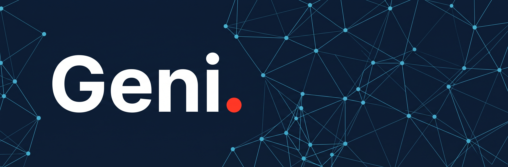
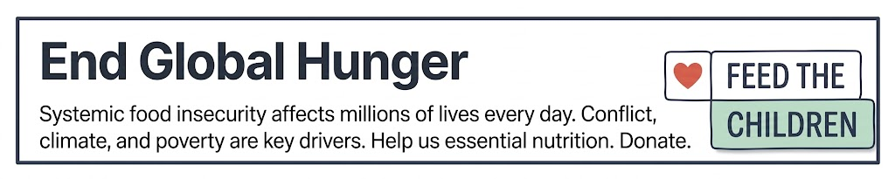

# Geni

[](https://github.com/masitings/geni-api/releases)
[](https://github.com/masitings/geni-api/actions/workflows/tests.yml)
[](LICENSE)
[](https://php.net)
[](https://laravel.com)

Geni is a static-analysis OpenAPI 3.1.0 documentation generator for Laravel. It reads your source files (routes, controllers, Form Requests, Resources, migrations) and produces a specification without ever booting your application or connecting to a database.

It includes a built-in standalone interactive documentation portal (`BladeRenderer`) that runs out-of-the-box with **zero JavaScript build step** (no React, no Vite, no node_modules required).

If you already annotate your API for [Scramble](https://scramble.dedoc.co/), Geni understands the same PHPDoc tags and the same attribute names; switching only requires rewriting `use` statements.

> 📖 **Full Documentation**: See [geni.masiting.dev](https://geni.masiting.dev/) for complete architecture details, configuration reference, PHP attributes, and end-to-end examples.



## Key Highlights

- **Zero database connections.** Column types are reconstructed offline from migration files.
- **Zero application boot for inference.** Route discovery is the only runtime touchpoint; everything else is static AST analysis.
- **Standalone docs UI out of the box.** Powered by Blade, Tailwind Play CDN, and Alpine.js with live search, Prism.js syntax highlighting, and an interactive Try It console.
- **Form-based or HTTP Basic Auth gate.** Protect documentation routes with isolated credentials independent of application user tables.
- **Runs anywhere your code does** (local checkouts, CI pipelines, pre-commit hooks).

## Installation

```bash
composer require masitings/geni-api
```

Publish the configuration file:

```bash
php artisan vendor:publish --tag=geni-config
```

## Quick Start

1. Configure migration paths and API routes in `config/geni.php` (defaults to `database_path('migrations')` and `/api/*`).
2. Export a specification file:

   ```bash
   php artisan geni:export --path=openapi.json
   ```

3. Or browse the interactive documentation live in your browser at `/docs/api` (gated to the `local` environment by default).

No annotations required: for endpoints using route-model binding, validated request bodies, and `JsonResource` responses, Geni infers schemas automatically.

## Commands Overview

| Command | Description |
|---|---|
| `php artisan geni:export {--path=} {--api=}` | Export the OpenAPI specification to a file |
| `php artisan geni:mcp {--path=} {--format=} {--base-url=}` | Generate an MCP tool manifest or client configuration for AI agents |
| `php artisan geni:mcp:serve {--api=} {--base-url=} {--timeout=}` | Run live MCP stdio server responding to `tools/list` and executing `tools/call` |
| `php artisan geni:check {--path=} {--api=}` | Compare current routes against committed spec; exits non-zero on drift |
| `php artisan geni:analyze {--json} {--api=}` | Inspect all unresolved inference diagnostics |
| `php artisan geni:cache {--api=}` / `geni:clear` | Pre-generate and cache the document, or clear cache |

## Model Context Protocol (MCP) Integration

Geni natively exports and executes your Laravel API as Model Context Protocol (MCP) tools, turning your application into an AI-ready toolkit. AI agents (Claude Code, Cursor, Windsurf, Claude Desktop) can discover, understand, and execute your endpoints directly without manual wrapper code or extra setup.

### What AI Agents Can Do With Your API

- **Autonomous Endpoint Discovery (`tools/list`)**: AI assistants automatically read all your routes, complete with request body parameters, validation constraints (required, email, min, max, enum), and response models inferred from your source code.
- **Direct Action Execution (`tools/call`)**: An AI agent can perform real tasks via your API. For example, ask your agent: *"Find the user with email alex@example.com and set their role to editor"*, and the agent will call `GET /api/users` and `PATCH /api/users/{id}` autonomously!
- **Safe Credential Injection**: Configure your Bearer token or API key in your environment. Credentials are automatically attached during execution and never exposed to the LLM context or tool schemas.

### 1. Live Stdio Execution (`php artisan geni:mcp:serve`)

Configure Claude Desktop or Claude Code to run Geni's built-in MCP server:

**Claude Desktop (`claude_desktop_config.json`)**:
```json
{
  "mcpServers": {
    "my-laravel-api": {
      "command": "php",
      "args": ["artisan", "geni:mcp:serve"],
      "cwd": "/path/to/laravel-app",
      "env": {
        "GENI_MCP_BEARER_TOKEN": "your-api-bearer-token",
        "GENI_MCP_API_KEY": "your-api-key"
      }
    }
  }
}
```

**Claude Code (`.mcp.json`)**:
```json
{
  "mcpServers": {
    "api": {
      "command": "php",
      "args": ["artisan", "geni:mcp:serve"]
    }
  }
}
```

### 2. Declarative Tools Manifest & Remote HTTP Discovery

- **Export Manifest File**:
  ```bash
  php artisan geni:mcp --path=mcp-manifest.json
  ```
- **Generate Client Bridge Configuration**:
  ```bash
  php artisan geni:mcp --format=client-config --base-url=https://api.example.com
  ```
- **Live HTTP Discovery & Execution Endpoint**:
  - `GET /docs/api/mcp` returns the standard MCP `tools/list` JSON envelope.
  - `POST /docs/api/mcp` accepts JSON-RPC 2.0 requests (`initialize`, `tools/list`, `tools/call`).

## Multi-Version API Documentation

Document multiple versions (e.g. `v1`, `v2`) or separate domains independently with automatic version-switching in the UI:

```php
// config/geni.php
'apis' => [
    'v1' => [
        'title' => 'API v1 (Legacy)',
        'version' => '1.4.0',
        'api_path' => 'api/v1',
    ],
    'v2' => [
        'title' => 'API v2 (Latest)',
        'version' => '2.0.0',
        'api_path' => 'api/v2',
    ],
],
```

When multiple versions are defined:
- Dedicated routes are registered: `/docs/api/v1`, `/docs/api/v2`, `/docs/api/v1.json`, `/docs/api/v2.json`, `/docs/api/v1/mcp`, `/docs/api/v2/mcp`.
- An interactive version switcher dropdown automatically appears in the sidebar header of the documentation portal.
- Single-API setups (empty `apis => []`) retain standard zero-overhead behavior without dropdowns.

## Spatie Laravel Data Support

Geni provides first-class, opt-in support for [Spatie Laravel Data](https://spatie.be/docs/laravel-data) (`spatie/laravel-data`):
- **Request parameters**: Controller action parameters type-hinting a class extending `Spatie\LaravelData\Data` automatically generate the OpenAPI request body schema.
- **Responses**: Controller return statements returning `new DataClass(...)`, `DataClass::from(...)`, `DataClass::collect(...)`, or declaring a `DataClass` return type hint generate accurate OpenAPI response schemas.
- **Validation attributes**: Spatie validation attributes (`#[Required]`, `#[Min]`, `#[Max]`, `#[Email]`, `#[Url]`, `#[Regex]`) are statically mapped to JSON Schema constraints.
- **Nested Data & Collections**: Nested Data classes and `DataCollection` returns are recursively resolved and referenced.
- **Zero runtime overhead**: Fully static AST analysis. The package never requires `spatie/laravel-data` at runtime.

## Laravel Actions Support

Geni provides first-class, opt-in support for [Laravel Actions](https://laravelactions.com) (`lorisleiva/laravel-actions`):
- **Single-action routes**: Routes registered as `Route::get('/users', CreateUserAction::class)` are automatically detected. Geni resolves `asController()` (preferred) or `handle()` as the execution method.
- **Rules extraction**: When an action defines a `rules()` method (or uses `ActionRequest`), request validation rules are statically inferred into the OpenAPI request body schema.
- **Authorization**: When an action defines an `authorize()` method with non-trivial logic, a 403 Forbidden response is automatically documented.
- **Summary derivation**: Operation summaries are cleanly derived from action class names (e.g. `CreateUserAction` -> "Create user") when no explicit summary annotation is provided.

## Spatie Laravel Query Builder Support

Geni statically inspects [Spatie Laravel Query Builder](https://spatie.be/docs/laravel-query-builder) (`spatie/laravel-query-builder`) calls on GET operations:
- **`allowedFilters(...)`**: Generates `filter[field]` query parameters with database column types automatically resolved from your migrations. Supports `AllowedFilter::exact`, `partial`, `scope`, and `trashed`.
- **`allowedSorts(...)` and `defaultSort(...)`**: Generates a unified `sort` query parameter with expanded ascending and descending enums and default values.
- **`allowedIncludes(...)`**: Generates an `include` query parameter listing available relation names.
- **`allowedFields(...)`**: Generates `fields[resource]` query parameters for sparse fieldsets.
- **`allowedAppends(...)`**: Generates an `append` query parameter listing dynamic model accessors.

## Divergences from Scramble

Geni parses code statically rather than evaluating runtime values:

1. **`Rule::in($variable)`**: Non-literal variables cannot be expanded into an enum. Geni documents the base type and records a diagnostic. *(Workaround: inline literal values, or add `@var`)*.
2. **Column types from migrations**: Relies on migration history. Pruned migrations via `schema:dump` require `schema_overrides`.
3. **`exists:table,column`**: Resolved offline from migration schemas rather than live database queries.

---

For in-depth guides on all features, custom renderers, security schemes, and PHP attributes, please read the full documentation at [geni.masiting.dev](https://geni.masiting.dev/).

## License

The MIT License (MIT). Please see [LICENSE](LICENSE) for more information.

---

[](https://pcrf1.app.neoncrm.com/campaigns/2026-pcrf---childhood-cancer-awareness)
